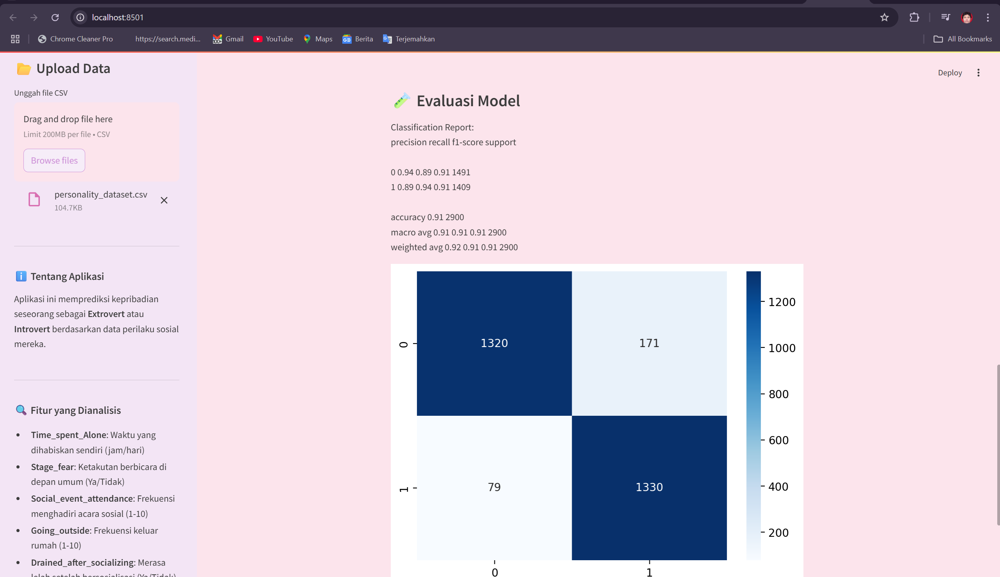
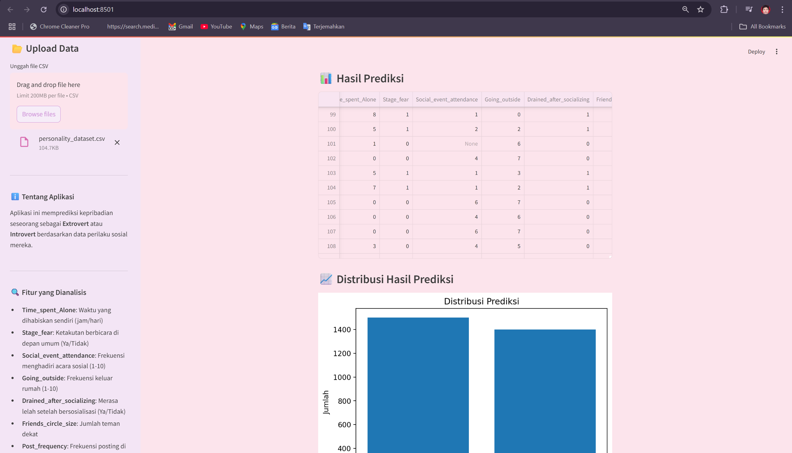

# PersonalityClassification
This project builds a personality classification model (introvert vs. extrovert) using social behavior data and machine learning algorithms, enabling automated personality insights from digital interactions, especially on social media.

In the modern era of increasing digital connectivity, understanding human personality has become more relevant than ever—not only in the field of psychology but also in the development of intelligent technologies. Human interactions within digital environments, particularly on social media, generate behavioral traces that can be analyzed to infer individual characteristics. This opens up new opportunities to automatically evaluate a person's personality through data-driven approaches. One widely studied dimension of personality is the introvert-extrovert spectrum, which has significant implications in various areas of life, from personal development to recruitment systems. Therefore, this study focuses on building a personality classification model using social behavior data and machine learning algorithms.

<h2>📷  Screenshots:</h2>

  

